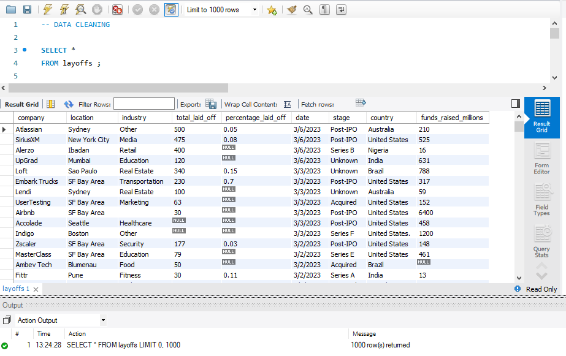
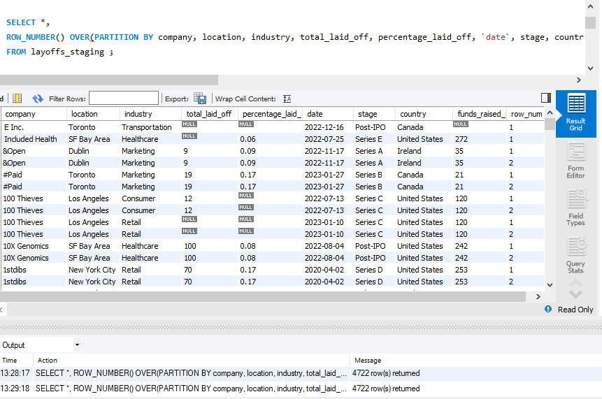
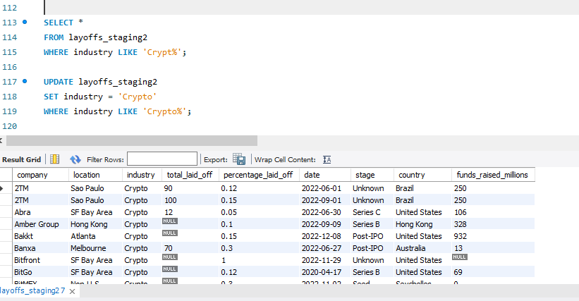
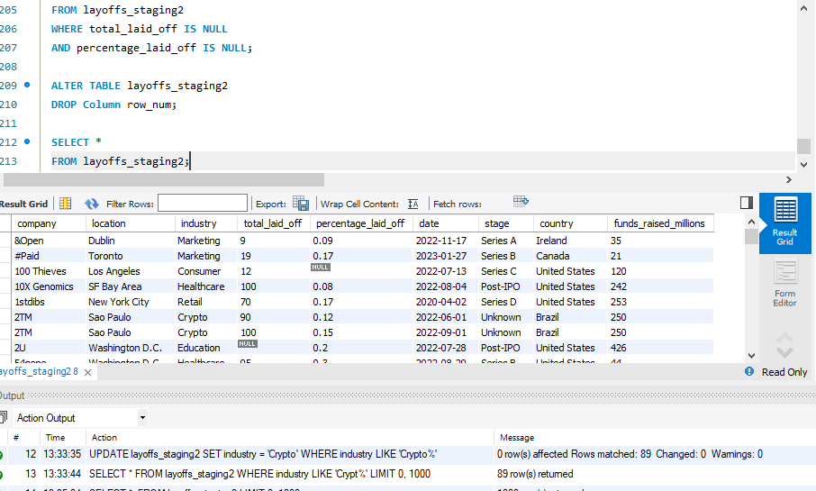

# SQL Data Cleaning Project – Layoffs Dataset

## Project Overview

This project demonstrates data cleaning techniques in MySQL using a real-world layoffs dataset. The goal was to transform raw data into a clean and analysis-ready dataset by removing duplicates, handling missing values, standardizing formats, and correcting inconsistencies.

## Skills Used

* SQL
* Data Cleaning
* Window Functions (ROW_NUMBER)
* Common Table Expressions (CTEs)
* Joins
* Data Standardization
* Null Value Handling
* Date Conversion

## Data Cleaning Process

1. Created a staging table.
2. Identified and removed duplicate records.
3. Standardized company names.
4. Standardized industry categories.
5. Standardized country names.
6. Converted dates to DATE format.
7. Handled NULL and blank values.
8. Removed records with insufficient information.
9. Produced a clean dataset ready for analysis.

## Project Screenshots

### Raw Dataset

### Duplicate Detection

### Data Cleaning Queries

### Final Cleaned Dataset

## Files

* DATA CLEANING.sql
* layoffs.csv
* screenshots/

## Outcome

The dataset was successfully cleaned and transformed into a structured format suitable for exploratory data analysis and business insights.

